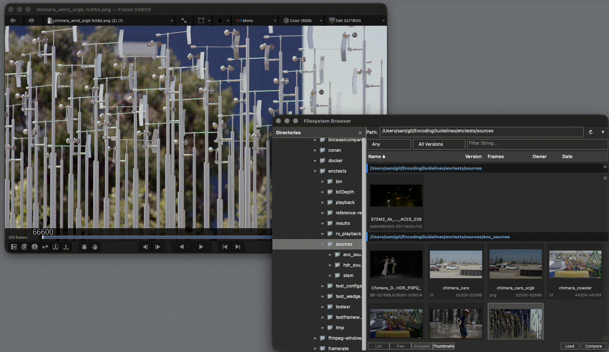

# Filesystem Browser

A multi-threaded filesystem browser plugin for visual effects review tools. Browse large directory trees, detect image sequences, filter by time or version, preview media on hover, and load files into the host application — all without blocking the UI.

Supports **xStudio** and **OpenRV**. The core plugin (`filesystem_browser/`) is host-agnostic; the `openrv_compat/` shim layer adapts it to OpenRV without modifying any shared code.



---

## Features

- **Non-blocking directory scan** — background thread pool with live progress; partial results stream to the UI as scanning proceeds
- **Image sequence detection** — groups frame ranges using [fileseq](https://github.com/justinfx/fileseq) (e.g. `shot.####.exr 1001-1100`)
- **Four view modes** — List, Tree, Grouped (compressed path tree), Thumbnails
- **ffmpeg thumbnails** — generated asynchronously by a 4-worker pool; persisted in a platform-appropriate cache directory across sessions; coalesced into a single UI refresh per 50 ms burst
- **Preview on hover** — single-click loads a clip temporarily; double-click commits it and discards the preview
- **Filtering** — free-text, modification-time bracket (last day / week / month), version filter (latest / latest 2)
- **Path autocomplete** — Tab-completion in the path field with arrow-key navigation
- **Quick Access** — pinned directories + recently visited history
- **Context menu** — Replace current media, Compare (A/B), Append, Copy path, Show in Finder
- **Environment-variable pins** — pre-populate bookmarks via `XSTUDIO_BROWSER_PINS`

---

## Project structure

```
rvplugin/
├── filesystem_browser/          # Host-agnostic core plugin
│   ├── filesystem_browser.py    #   Plugin class, command dispatch, thumbnail worker pool
│   ├── scanner.py               #   Multi-threaded BFS directory scanner
│   ├── config.json              #   Default extensions, ignored directories, scan depth
│   └── qml/FilesystemBrowser.1/ #   QML UI (works in both hosts)
│       ├── FilesystemBrowser.qml
│       ├── DirectoryTree.qml
│       └── XsFileSystemStyle.qml
│
├── openrv_compat/               # OpenRV shim layer
│   ├── plugin_base.py           #   Replaces xstudio.plugin.PluginBase
│   ├── attribute.py             #   Replaces xstudio attribute/role types
│   ├── attribute_bridge.py      #   QObject bridge: Python attrs ↔ QML (50 ms coalescing timer)
│   ├── host_interface.py        #   Media loading via rv.commands (addSourceVerbose, deleteNode …)
│   └── qml_stubs/xStudio/       #   QML modules that stand in for xStudio 1.0
│
├── openrv_mode.py               # OpenRV MinorMode entry point (createMode)
├── standalone.py                # Run the browser without OpenRV (PySide6, logs to stdout)
├── makepackage.csh              # Build filesystembrowser.zip for rvpkg
└── PACKAGE                      # rvpkg manifest
```

---

## Installation

### OpenRV

**Requirements:** OpenRV 2024+, `fileseq` on the Python path (ships with OpenRV), `ffmpeg` on `$PATH` or in the OpenRV app bundle for thumbnails.

```bash
cd rvplugin
bash makepackage.csh              # produces filesystembrowser.zip

# Copy to your RV support area and install
cp filesystembrowser.zip ~/Library/Application\ Support/RV/Packages/
rvpkg -install -add ~/Library/Application\ Support/RV/Packages \
      ~/Library/Application\ Support/RV/Packages/filesystembrowser.zip
```

To reinstall after making changes:

```bash
bash makepackage.csh
cp filesystembrowser.zip ~/Library/Application\ Support/RV/Packages/
rvpkg -force -uninstall "Filesystem Browser"
rvpkg -force -install ~/Library/Application\ Support/RV/Packages/filesystembrowser.zip
```

### xStudio

Copy `filesystem_browser/` into your xStudio plugin directory and register `filesystem_browser.py` as a plugin. The `openrv_compat/` directory is not needed.

---

## Usage

| Action | Result |
|---|---|
| **File → Filesystem Browser** | Open the floating browser window |
| **B** | Toggle the browser (keyboard shortcut) |
| Single-click a file | Preview it temporarily in the viewer |
| Double-click a file | Load it permanently; preview source is removed |
| Double-click a folder | Navigate into it |
| Right-click a file | Replace / Compare / Append / Copy path / Show in Finder |
| **Tab** in path field | Autocomplete directory name |
| **↑ / ↓** in path field | Navigate completions |
| **↻** button | Force rescan |
| **▼** button | Quick Access (history + pins) |

---

## Standalone testing (no OpenRV required)

```bash
cd rvplugin
python standalone.py ~/Movies
```

Opens a floating browser window backed by the real plugin. Media operations (load, preview, etc.) are printed to stdout instead of being sent to a host application. Useful for iterating on the UI or diagnosing thumbnail / scan performance without reinstalling the package.

Requires PySide6 and ffmpeg on `$PATH`.

---

## Configuration

### config.json

```json
{
  "extensions": [".mov", ".mp4", ".exr", ".dpx", ".jpg", ".png", "…"],
  "ignore_dirs": [".git", ".DS_Store", "…"],
  "root_ignore_dirs": [],
  "max_recursion_depth": 6,
  "auto_scan_threshold": 4,
  "thumbnail_cache_max_mb": 500,
  "thumbnail_cache_dir": {
    "Darwin":  "~/Library/Caches/filesystem_browser/thumbs",
    "Linux":   "/var/tmp/filesystem_browser/thumbs",
    "Windows": "%LOCALAPPDATA%\\filesystem_browser\\thumbs"
  }
}
```

`auto_scan_threshold` — directories at or above this filesystem depth require a manual "Scan Directory" confirmation before scanning begins (prevents accidentally scanning `/` or `/Users`).

`thumbnail_cache_max_mb` — maximum total size of the thumbnail cache in megabytes. The least-recently-accessed thumbnails are evicted when the limit is exceeded.

`thumbnail_cache_dir` — per-platform cache location. Keys match Python's `platform.system()` values (`Darwin`, `Linux`, `Windows`). Both `~` and environment variables (e.g. `%LOCALAPPDATA%`) are expanded. Can also be a plain string to use the same path on all platforms. On Linux the default is a local `/var/tmp` path specifically to avoid writing to potentially NFS-mounted home directories.

### Environment variables

| Variable | Description |
|---|---|
| `XSTUDIO_BROWSER_PINS` | Pre-populate pinned directories. JSON list of `{"name": …, "path": …}` objects, or a colon-separated path string. |
| `FFMPEG_PATH` | Override the ffmpeg binary used for thumbnail generation. |

---

## Architecture notes

### Host abstraction

`FilesystemBrowserPlugin` calls methods on `self.host` for all media operations. In xStudio the host is `XStudioHostInterface` (defined in `filesystem_browser.py`). In OpenRV it is replaced after construction:

```python
plugin = FilesystemBrowserPlugin(mode)
plugin.host = OpenRVHostInterface(mode, plugin)
```

### OpenRV shim layer

Before `filesystem_browser.py` is imported, `openrv_mode.py` installs lightweight fake modules at `xstudio`, `xstudio.plugin`, and `xstudio.core` so the plugin sees a compatible surface without any changes to the shared code.

### OpenRV media API

| OpenRV function | Purpose |
|---|---|
| `addSourceVerbose([path])` | Add a source; returns the `RVFileSource` node name |
| `nodeGroup(node)` | Get the parent `RVSourceGroup` (pass to `setViewNode`) |
| `setViewNode(group)` | Switch the viewer to a source |
| `setSourceMedia(fsNode, [path], "")` | Swap media in an existing source in-place (used for hover preview) |
| `deleteNode(group)` | Remove a source from the session (`deleteSource` does not exist in the Python bindings) |

### Thumbnail coalescing

Worker threads update `thumbnailSource` fields in the results list and schedule a 50 ms `threading.Timer` flush. The timer is cancelled and restarted on each completion, so a burst of four workers finishing simultaneously produces one `set_value()` call and one QML model rebuild. The OpenRV `AttributeBridge` applies a second 50 ms QTimer coalesce before emitting Qt signals.
